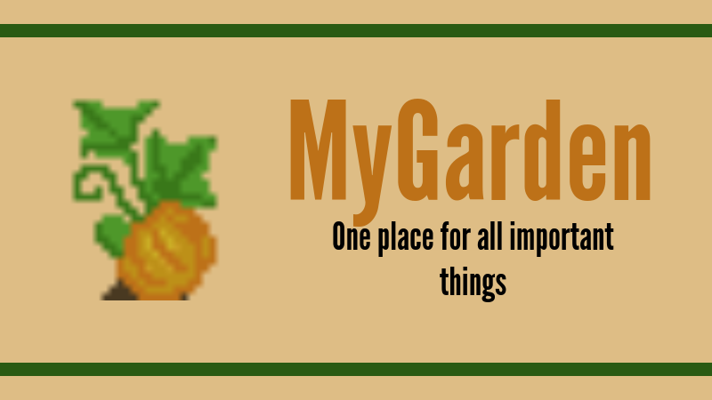
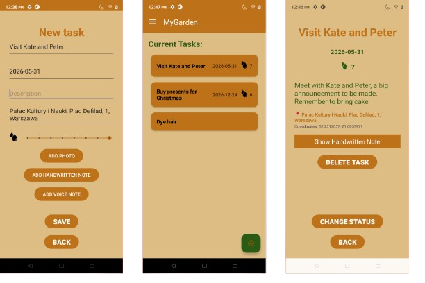
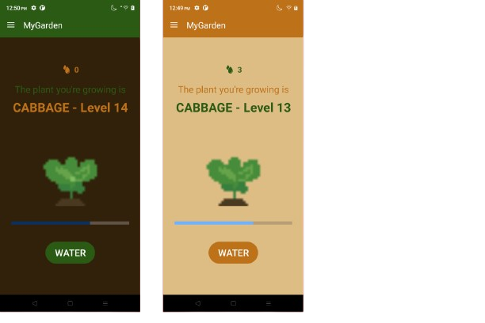

**MyGarden** is an Android application created during *Mobile Programming* course at *Theoretical Computer Science, Jagiellonian University*. It's designed to help keeping track of urgent, and not so urgent, matters. Dinner with grandpa? Address, date and dresscode, all in one place. Shopping? Quick photo of list, handy when coming home from college. No motivation? What about growing your own vegetables while being productive?

## Functionalities
* local database
* integration with camera
* location tracking, *Photon API* for geotracking
* microphone, speaker
* hand drawings
* light and dark mode
* sorting
* editing
* navigating by subtasks and parenttasks

## Overview

### For assets info read [assets readme](app/src/main/README.md)
